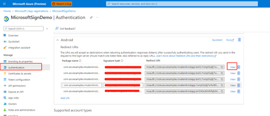
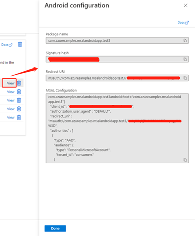

# Sign-in users with a Microsoft Account to Android apps using Microsoft Quick Authentication


On Android, Microsoft Quick Authentication offers a library that makes it easier to add **Sign in with Microsoft** support to native apps. Quick Authentication uses the Microsoft Authentication Library (MSAL) for Android to handle authentication and authorization for users with personal Microsoft accounts.

> Microsoft Quick Authentication is in public preview. This preview is provided without a service-level agreement and isn't recommended for production workloads. Some features might be unsupported or have constrained capabilities. For more information, see [Supplemental terms of use for Microsoft Azure previews](https://azure.microsoft.com/en-us/support/legal/preview-supplemental-terms/).

## How it works
Microsoft Quick Authentication allows you to easily add a fully functioning sign-in button to your Android application that will take the user through the sign-in workflow with a Microsoft Account (MSA). Additionally, Quick Authentication allows you to sign-in your users silently whenever possible, to let them sign out of your application, and to perform more advanced tasks such as requesting an access token to retrieve additional account information. **[TODO** mention Microsoft Graph here?]

To enable Quick Authentication in your application, you will need to follow these high level steps. Each step is further detailed in the rest of this document. 
- First register your application for Android on Azure (you can reuse the same Azure registration as for your web site). 
- Declare a dependency on the Quick Authentication SDK. 
- Add an intent filter for Quick Authentication to your app manifest. 
- Create a Quick Authentication sign-in client object ([MSQASignInClient](https://microsoft.github.io/quick-authentication/docs/android/javadocs/com/microsoft/quickauth/signin/MSQASignInClient.html)) with the proper configuration.
- Add a Quick Authentication sign-in button somewhere in your application's layout xml or instantiate it programmatically.
- Set a callback on the sign-in button to be notified when the user has completed the sign-in workflow.
- Implement the callback to integrate the user account with your identity system.

Quick Authentication will show a fully functioning sign-in button, looking as follows in its default form, and customizable like with Quick Authentication for the web:

[**TODO**: capture and insert image from actual phone]

  

Note that at this time, the personalization of the user experience available with Quick Authentication for the web is not available to Android native apps. However, your users will still be able to sign-in using the button shown above, and benefit from SSO in some circumstances.

## Registering your application
If you have already registered a single-page web application, you can reuse the same application registration. To find that registration go to [Microsoft | App registrations](https://ms.portal.azure.com/#view/Microsoft_AAD_IAM/ActiveDirectoryMenuBlade/~/RegisteredApps) and select your existing application registration in the list. This will open a page describing your application registration.

 If you have not yet registered an application or wish to use a new registration, complete the steps in [Register an application with the Microsoft identity platform](https://docs.microsoft.com/en-us/azure/active-directory/develop/quickstart-register-app) to register your application.

Now that you have created an application registration, you can extend it to Android as follows. On the Azure page describing your app registration:
1. Open the *Authentication* tab on the left of that page
3. Click *Add Platform*
4. Select *Android*
5. Enter the package name. Your app's package name can be found in the Android Manifest for your app.
6. Using the command line indicated under the *Signature hash* section, generate a signature hash
7. Click *Configure*

[**TODO:** Add screen shots to list above]

## Declaring a dependency on Quick Authentication
Add the following to your app's `build.gradle`
```java
dependencies {
    implementation 'com.microsoft.quickauth:signin:1.0.0'
}
```
And add the following to the *repositories* section in your `build.gradle`
```java
mavenCentral()
maven { 
    url 'https://pkgs.dev.azure.com/MicrosoftDeviceSDK/DuoSDK-Public/_packaging/Duo-SDK-Feed/maven/v1'
}
```
## Creating a configuration file 
The configuration file is necessary to initialize the Quick Authentication SDK and underlying MSAL library. Details on this file can be found here: [MSAL Configuration](https://docs.microsoft.com/azure/active-directory/develop/msal-configuration)

It is a JSON file which can be obtained from the Azure Portal with a few additions. Go to [Microsoft | App registrations](https://ms.portal.azure.com/#view/Microsoft_AAD_IAM/ActiveDirectoryMenuBlade/~/RegisteredApps) and select your existing application registration in the list. On the page for your application registration, click *Authentication* on the left bar".

 

In the Authentication page, click the *View* button for your redirect URL to open this page:

 

Copy the MSAL Configuration JSON script and make the following edits:

- Enter the redirect URI. You can get your app's redirect URI from the Azure application registration page. For more information on common redirect URI issues please refer to [this FAQ](https://github.com/AzureAD/microsoft-authentication-library-for-android/wiki/MSAL-FAQ#redirect-uri-issues).
 - Below the redirect URI please paste:
 ``` java
 "account_mode" : "SINGLE",
 ```
Your configuration JSON script should resemble this example:
```json 
{
  "client_id": "<YOUR_CLIENT_ID>",
  "authorization_user_agent": "DEFAULT",
  "redirect_uri": "msauth://<YOUR_PACKAGE_NAME>/<YOUR_BASE64_URL_ENCODED_PACKAGE_SIGNATURE>",
  "account_mode": "SINGLE",
  "broker_redirect_uri_registered": true,
  "authorities": [
    {
      "type": "AAD",
      "audience": {
        "type": "PersonalMicrosoftAccount",
        "tenant_id": "consumers"
      }
    }
  ]
}
```

Then, save this JSON script as a "raw" resource file in your project resources. You will be able to refer to it using the generated resource identifier. You will need it to initialize [MSQASignInClient](https://microsoft.github.io/quick-authentication/docs/android/javadocs/com/microsoft/quickauth/signin/MSQASignInClient.html)

## Configuring an intent filter
Next, configure an intent filter in the Android Manifest for your application, using the same redirect URI you used for the Configuration JSON script above:
```xml
<activity android:name="com.microsoft.identity.client.BrowserTabActivity">
    <intent-filter>
        <action android:name="android.intent.action.VIEW" />
        <category android:name="android.intent.category.DEFAULT" />
        <category android:name="android.intent.category.BROWSABLE" />
        <data
            android:host="<YOUR_PACKAGE_NAME>"
            android:path="/<YOUR_BASE64_ENCODED_PACKAGE_SIGNATURE>"
            android:scheme="msauth" />
    </intent-filter>
</activity>
```
## Creating MSQASignInClient
`MSQASignInClient` is the main object in the Quick Authentication SDK. It gives you access to all functionality. To create it, you must first create a instance of [MSQASignInOptions](https://microsoft.github.io/quick-authentication/docs/android/javadocs/com/microsoft/quickauth/signin/MSQASignInOptions.html), which holds specific options you want to use to create `MSQASignInClient`. The example below creates an instance of `MSQASignInOptions` holding the JSON configuration file you created above. Put this code in your sign-in activity's `onCreate` method.
```java
MSQASignInOptions signInOptions = new MSQASignInOptions.Builder()
        .setConfigResourceId(R.raw.auth_config_single_account)
        .build();
```
| Option setter | Description |
|---|---|
| setConfigResourceId |	Sets the resource id of the configuration file you created in section [Create a configuration file](). |

Other options can be used, for example to configure logging. Refer to the [reference documentation](./quick-authentication-android-reference.md) [**TODO** or section on Logging below?] for additional options. 

Then to create `MSQASignClient`, use its static `Create` method:
```java
public static void create(@NonNull Context context,
                          @NonNull MQASignInOptions options,
                          @NonNull ClientCreatedListener listener);
```
| Parameters | Description
|---|---|
| @NonNull context | Application's context. Cannot be null. [TODO] more details.
| @NonNull signInOptions | The option object you created above.
| @NonNull listener | `ClientCreatedListener` is a callback to be invoked when the client object is successfully created. Cannot be null.
| Returned value | none

Note that if the "raw" resource file does not exist, listener’s onError will get called.
If the creation completes successfully, `listener.onCreated` will get called and return the newly created instance of `MSQASignInClient`.

Here is an example of calling the `create` method:
```java
MSQASignInClient.create(context,
        new MQASignInOptions.Builder()
                .setConfigResourceId(R.raw.auth_config_single_account)
                .build(),
        new ClientCreatedListener() {
            @Override
            public void onCreated(@NonNull MSQASignInClient client) {
                // use client
            }
 
            @Override
            public void onError(@NonNull MSQAException error) {
                // handle error
            }
        });
```

## Using a Sign-in Button
The easiest way to implement the sign-in flow with Quick Authentication is to use a pre-build Sign-in Button. Simply insert the following in your application's layout xml in the desired place: 

```java
<com.microsoft.quick.auth.signin.view.MSQASignInButton
  android:id="@+id/sign_in_button"
```
This will create a fully functional button looking like this:


The look and feel of this button can be modified in a variety of ways by either specifying attributes in the xml above or programmatically. Look at the [reference documentation](./quick-authentication-android-reference.md) for a more detailed description.

To programmatically set specific attributes on the button or to set the callback to be called when sign-in completes (see next section), you will need to retrieve the `MSQASignInButton` view object. The easiest is to assign an id to your button in the layout xml and find its view by id as follows:

```java
MSQASignInButton signInButton = findViewById(R.id.sign_in_button);/>
```

## Handling the authentication events
As described above, the Sign-in Button is functional and clicking it will run the sign-in user experience. However, in your application you need a way to know that sign-in completed successfully and to retreive properties of the account, such as username, email address, full name, and photo. The following method of [MSQASignInButton](https://microsoft.github.io/quick-authentication/docs/android/javadocs/com/microsoft/quickauth/signin/view/MSQASignInButton.html) allows to set that callback:

```java
public void setSignInCallback (
        @NonNull Activity activity,
        @NonNull MSQASignInClient client,
        @NonNull OnCompleteListener <AccountInfo> onCompleteListener);
```
| Parameters | Description |
|--|--|
| @NonNull  activity | Activity that is used as the parent activity for launching sign page.
| @NoNull client | A sign-in client object, provides sign-in, sign-out etc.
| @NoNull listener |  A callback to be invoked when sign-in completed, canceled or failed.
| Returns | none

If sign-in succeeds, `listener` will be invoked, and first parameter will return the account info and the `error` parameter will be null. If it fails, `accountInfo` will be null and `error` will contain the error.

Code example:
```java
signInButton.setSignInCallback(activity, client,
        new OnCompleteListener<AccountInfo>() {
            @Override
            public void onComplete(@Nullable AccountInfo accountInfo,
                                   @Nullable MSQAException error) {
                if (accountInfo != null) {
                    // successful sign-in: use account
                } else {
                    // unsuccessful sign-in: handle error
                }
            }
        });
```
The returned `AccountInfo` interface, returned by the listener, provides the following methods for getting at the returned user account information:

| Method | Description
|--|--|
| @Nullable String getFullName() | full name |
| @Nullable String getUsername() | user email or phone |
| @Nullable String getId() | Unique account/user id |
| @Nullable String getIdToken() | [ID token](https://docs.microsoft.com/en-us/azure/active-directory/develop/id-tokens) received during sign-in process|
| @Nullable String getBase64Photo() | User account picture (jpeg, png, etc.) as a base64 encoded string.


## Signing out
You can request to sign the user out using the following method of MSQASignInClient

```java
void signOut(@NonNull OnCompleteListener<Boolean> listener);
```

| Parameters | Description |
|--|--|
| @NonNull listener | A callback to be invoked when sign out finishes and will return sign-out result.|
| Returns | none |

If sign-out succeeds, `listener` will be invoked and the first parameter will return true, the second parameter will return null. If it fails, the first parameter will be false and `error` will contain the error.

Code example:
```java
signInClient.signOut(new OnCompleteListener<Boolean>() {
    @Override
    public void onComplete(@Nullable Boolean signOutSuccess,
                           @Nullable MSQAException error) {
        if (signOutSuccess) {
            // sign out success
        } else {
            // handle error
        }
    }
});
```

Use these as follows
## Logging
To facilitate debugging you have the following options to configure logging using "setter" methods of [MSQASignInOptions.Builder](https://microsoft.github.io/quick-authentication/docs/android/javadocs/com/microsoft/quickauth/signin/MSQASignInOptions.Builder.html) that can be chained in the manner showed in the example below when creating an instance of `MSQASignInOptions`:
```java
MSQASignInOptions signInOptions = new MSQASignInOptions.Builder()
        .setConfigResourceId(R.raw.auth_config_single_account)
        .setEnableLogcatLog(true)
        .setLogLevel(LogLevel.VERBOSE)
        .setExternalLogger((logLevel, message) -> {
            // get log message here
            ```
        })
        .build();
```

| Option setter | Description |
|---|---|
setLogLevel(@LogLevel int logLevel) | Sets the log level for diagnostic purpose. By default, the sdk enables the verbose level logging. |
| setEnableLogcatLog(boolean enableLogcatLog)	| True: enable the Android logcat logging. <br>False: disable the Android logcat logging. |
| setExternalLogger(@NonNull  ILogger externalLogger)	| Configures external logging to configure a callback that the sdk will use to pass each log message. |

## Next steps

For more details about prompt configuration and API reference, see [Microsoft Quick Authentication configuration](./quick-authentication-android-reference.md).