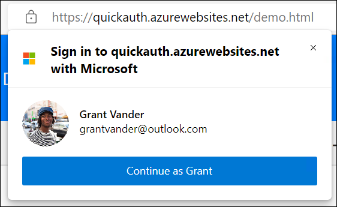

# Sign in Microsoft account users to single-page apps with Microsoft Quick Authentication

| [*Getting Started*](./quick-authentication-how-to.md)| [Reference](./quick-authentication-reference.md) || [*Web*](./quick-authentication-how-to.md) | [Android](./quick-authentication-android-how-to.md) | [iOS](./quick-authentication-ios-how-to.md) |
|--|--|--|--|--|--|

Microsoft Quick Authentication is a lightweight JavaScript library that makes it easier to add **Sign in with Microsoft** support to a single-page app (SPA). Quick Authentication uses the  Microsoft Authentication Library for JavaScript (MSAL.js) to handle authentication and authorization for users with personal Microsoft accounts from Outlook, OneDrive, Xbox Live, and Microsoft 365.

> Microsoft Quick Authentication is in public preview. This preview is provided without a service-level agreement and isn't recommended for production workloads. Some features might be unsupported or have constrained capabilities. For more information, see [Supplemental terms of use for Microsoft Azure previews](https://azure.microsoft.com/en-us/support/legal/preview-supplemental-terms/).

## How it works

To enable Quick Authentication, you first add a reference to the library in a `<script>` element, then an HTML or JavaScript snippet that displays the sign-in button on the page.

By default, when a user clicks on the button, it opens a popup. You can configure the button. After user enters their credentials in the popup, they get user sign-in information in a JavaScript callback present in their web page. This is called the "popup" mode.

It is also possible to configure your application for [redirect mode](#redirect-mode). In this case, when a user clicks on the button, there is full page redirection to the MSA sign-in page. After user enters credentials successfully on the MSA sign-in page, a `POST` request will be sent to your server, as opposed to a call to your Javascript callback. Your server needs to use information present in `POST` request and perform additional work to get user account information. Check [this section](#redirect-mode) for more details.

All browsers support a configurable sign-in button and prompt provided by Quick Authentication called the _standard sign-in experience_. Microsoft Edge supports an _enhanced sign-in experience_, which is also configurable.

In the _enhanced sign-in experience_, the sign-in process is completed without the user needing to explicitly enter their credentials.

- **Standard sign-in experience** - Quick Authentication shows the _standard_ sign-in button and prompt to users not signed in to Microsoft Edge or that are using a another browser.

  

- **Enhanced sign-in experience** (Microsoft Edge desktop platforms _only_) - Microsoft Edge users who've signed-in to the browser with their personal Microsoft account are shown a personalized sign-in button and prompt (also customizable).

    In this public preview, [Microsoft Edge](https://www.microsoft.com/en-us/edge?r=1) is required for the enhanced experience.

  

  Here's an example of sign-in prompt in MSA profile in Edge: 

## Browser support

Unless otherwise noted, browser compatibility applies only to the two most recent (current and previous) stable supported versions of the specified browser.

| Browser             | Standard <br/>sign-in experience                                      | Enhanced <br/>sign-in experience                                      |
|---------------------:|:----------------------------------------------------------------------:|:----------------------------------------------------------------------:|
| Firefox             |  |   |
| Google Chrome       |  |   |
| Microsoft Edge (Windows, Mac, Linux)      |  |   |
| Microsoft Edge (Other platforms)     |  |   |
| Safari              |  |   |

## Register your application

First, complete the steps in [Register an application with the Microsoft identity platform](https://docs.microsoft.com/en-us/azure/active-directory/develop/quickstart-register-app) to register your single-page application.

Use the following settings for your app registration. **Bold text** in the table represents a UI element in the Azure portal and `code-formatted text` indicates a value you enter.

| App registration setting    | Value                                                                  | Notes                                                     |
|----------------------------:|:-----------------------------------------------------------------------|:----------------------------------------------------------|
| **Name**                    | `SPA with Quick Auth`                                                  | Suggested value. You can change the app name at any time. |
| **Supported account types** | **Personal Microsoft Accounts Only**                                   | Required value for Microsoft Quick Authentication.        |
| **Platform type**           | **Single-Page Application**                                            | Required value for Microsoft Quick Authentication.        |
| **Redirect URI for Single-Page application (SPA)**      | `http://localhost:<port>/blank.html` or `https://<your-tenant-id>/blank.html` | Recommended for Microsoft Quick Authentication.           |

Redirect flow will need additional steps. Check [this section](#enabling-application-for-redirection) for more details.

## Add the Quick Authentication script

Next, add a `script` element that adds the Quick Authentication library reference (_ms\_auth\_client.min.js_) to your application. It's safe to add the `defer` attribute to load the script asynchronously.

```html
<script async defer
        src="https://edge-auth.microsoft.com/js/ms_auth_client.min.js"
        ></script>
```

## Choose an integration method: HTML or JavaScript

There are two ways to add Quick Authentication to your app:

- **HTML**: If have access to the application's HTML, [add the sign-in button in HTML](#option-1-add-sign-in-button-via-html).
- **JavaScript**: If you don't have access to the HTML, [add the sign-in button with JavaScript](#option-2-add-sign-in-button-via-javascript).

## Option 1: Add sign-in button via HTML

If you have access to adjust your application's HTML, this approach offers a declarative way to configure Quick Authentication.

### 1. Configure the library

Add the configuration `div` to your page:

```html
<div id="ms-auth-initialize"
      data-client_id="<your application client ID>"
      data-callback="<your callback function>"
      data-login_uri="<your application's Single-page application (SPA) redirect URI>">
</div>
```

- Set `data-client_id` to the Application (client) ID of the application registration.
- Set `data-callback` to the name of the JavaScript function you'd like called when a user is authenticated
- Set `data-login_uri` to the redirect URI for Single-page application (SPA) you entered in your application registration in the Azure portal. If this value isn't set, then for application https://abc.com, Quick Authentication library will use https://abc.com/blank.html as the default.
- `data-callback` should be a string, which represents a function, which is present in JavaScript on the web-page. Else initialization will fail.

You'll need to write JavaScript code to receive the authentication event and handle completing the registration and sign-in processes. We'll discuss how to do that, below.

### 2. Inject the sign-in button

Place a `div` in your authentication component to indicate where Quick Authentication should render the button:

```html
<div class="ms-auth-button"></div>
```

For details about modifying the sign-in button's appearance and the prompt's appearance and behavior, see the [Quick Authentication library reference](./quick-authentication-reference.md).

## Option 2: Add sign-in button via JavaScript

Use this approach if you don't have the ability to modify the application's HTML.

### 1. Configure the library

Configuration of the Quick Authentication library can safely happen when the page has finished loading, by calling `ms.auth.initialize` and passing it a configuration object:

```javascript
window.onload = function () {
  const result = ms.auth.initialize({
    client_id: '<your application client ID>',
    callback: <your callback function>,
    login_uri: '<your application's Single-page application (SPA) redirect URI>',
    cancel_on_tap_outside: false
  });
  if (result.result == 'success') {
    // Proceed.
  } else {
    // Initialization failed.
    console.error('ms.auth.initialize failed: ', result);
  }
};
```

- Set `client_id` to the Application (client) ID of the application registration.
- Set `callback` to the name of the JavaScript function you'd like called when a user is authenticated.
- Set `login_uri` to the redirect URI you entered in your application registration in the Azure portal. If this property isn't set, then for application https://abc.com, Quick Authentication library will use https://abc.com/blank.html as the default.

If `ms.auth.initialize` succeeds, it returns `{result: 'success'}`. If `ms.auth.initialize` fails, it returns `{result: 'failure', reason: <string-explaining-why-it-failed>}`.

The following are some possible reasons for failure:

- Initialization was called more than once. Here API returns `{result: 'failure', reason: 'Library already initialized'}`.
- `callback` isn't a valid function or `client_id` isn't set. In these cases, API returns `{result: 'failure', reason: 'Invalid configuration'}`.

You'll need to write JavaScript code to receive the authentication event and handle completing the registration and sign-in processes. We'll discuss how to do that, below.

[Quick Authentication can be configured](./quick-authentication-reference.md) to allow more control over the behavior of the library.

### 2. Inject the button

To render a sign-in button, call the following JavaScript just after initializing the library (shown above):

```javascript
ms.auth.renderSignInButton(
  document.getElementById('<id of parent element>'),
  {} // Using default options.
);
```

You'll need to identify the DOM node that you want the library to insert the button into. If DOM node is `null` or `undefined` because it wasn't found, then this API will throw exception.

Quick Authentication allows you to [customize the look and feel of the button](./quick-authentication-reference.md#customizing-the-sign-in-button) to better align with your application's design. We'll discuss more about customizing the look and feel of the button, below.

## Responding to authentication events

When an authentication event occurs, the Quick Authentication library calls the `callback` function you specified in the configuration, passing in a [SignInAccountInfo](./quick-authentication-reference.md#data-type-signinaccountinfo) object containing the user's account details as a parameter. If sign-in fails, then [SignInAccountInfo](./quick-authentication-reference.md#data-type-signinaccountinfo) will be `null` and the second argument [SignInErrorInfo](./quick-authentication-reference.md#data-type-signinerrorinfo) will contain details about the error. If sign-in succeeds, [SignInErrorInfo](./quick-authentication-reference.md#data-type-signinerrorinfo) will be `null`.

```javascript
function myCallback(signInAccountInfo, signInErrorInfo) {
  console.log(signInAccountInfo);
  if (!signInAccountInfo) {
    // Sign in failed. signInErrorInfo will be non-null.
    const errorCode = signInErrorInfo.errorCode; // Short string.
    const errorMessage = signInErrorInfo.errorMessage; // Longer string.
    console.log(`sign in failed: errorCode: ${errorCode}, errorMessage: ${errorMessage}`);
    return;
  }
  // Sign-in succeeded. Use signInAccountInfo in sign in/up logic.
}
```

The [SignInAccountInfo](./quick-authentication-reference.md#data-type-signinaccountinfo) object includes the following properties:

- `fullName` - the user's full name
- `surname` - the user's surname
- `givenName` - the user's given name
- `username` - the user's email address or phone number
- `email` - the user's email address
- `photoUrl` - a base64-encoded dataURI representing the user's avatar
- `id` - a GUID that is unique across all Microsoft accounts
- `homeAccountId` - the user's home account identifier which is used by MSAL
- `idToken` - [ID token](https://docs.microsoft.com/en-us/azure/active-directory/develop/id-tokens) received during sign-in process

We recommend using the `id` as a key, rather than the email address, because an email address isn't a unique account identifier. It's possible for a user to use a Gmail address for a Microsoft Account, and to potentially create two different accounts (a Microsoft account and a Google account) with that same email address. It's also possible for a Microsoft Account user to change the primary email address on their account.

The callback on sign-in failure comes through for attempts to sign-in with a) button b) sign-in prompt c) [ms.auth.startSignIn](./quick-authentication-reference.md#method-msauthstartsignin) API.

As an example of [SignInErrorInfo](./quick-authentication-reference.md#data-type-signinerrorinfo), if user cancels out of the sign-in flow, they will get the following error info object.
```javascript
{
 errorCode: 'user_cancelled',
 errorMessage: 'User cancelled the flow'
}
```

## Signing out

Use `ms.auth.signOut()` to sign out a user:

```javascript
ms.auth.signOut(homeAccountId, function (result) {
  if (result.result) {
    // Finish the logout process in your application.
  } else {
    console.log('Sign out failed, error: ', result.error);
  }
});
```

You'll need to pass in `homeAccountId` field of `AccountInfo` object you received as part of the authentication event and a callback to receive the result of the `signOut()` call. The argument returned to the callback will be an object with the following structure:

- `result` - `true` if the user was signed out, `false` if not
- `error` - if `result==false`, will be an object with a `message` property explaining the error

## Advanced: Querying authentication status

You can determine if the current user is signed-in by calling `ms.auth.startGetCurrentAccount()` and passing in the name of a callback function that is ready to receive the account information:

```javascript
function accountCallback(account_info) {
  if (account_info) {
    // Use account.
  }
}

ms.auth.startGetCurrentAccount(accountCallback);
```

When called, `startGetCurrentAccount()` will trigger the callback and pass in a value. If the user is signed-in, the argument will be an [AccountInfo](./quick-authentication-reference.md#data-type-accountinfo) object. If the user isn't signed-in, the argument will be `null`.

## Customizing the Quick Authentication experience

To fully control your users authentication experience, build and maintain your own button to trigger the sign-in flow.

### Start the sign-in process

To begin the sign-in process when a user activates your custom button, you'll need to call `ms.auth.startSignIn()`:

```javascript
button.addEventListener('click', function() {
  ms.auth.startSignIn();
});
```

As with the previous examples, successful authentications will be routed into the callback you defined when initializing the library.

`ms.auth.startSignIn` can also be called with additional parameters to change the callback behavior. Check [API documentation](./quick-authentication-reference.md#method-msauthstartsignin) for more info.

### Show the sign-in prompt

If you want to control the display of the enhanced sign-in prompt in Microsoft Edge, use the `ms.auth.prompt()` method:

```javascript
ms.auth.prompt('right', function(notification) {
  const reason = notification.reason;
  if (notification.type === 'display' && !notification.displayed) {
    if ( reason === 'browser_not_supported' ) {
      console.log('prompt not supported in browser');
    }
  } else if (notification.type === 'skipped') {
    if (reason === 'user_cancel') {
      console.log('user cancelled');
    }
  } else if (notification.type === 'dismissed') {
    if (reason === 'credential_returned') {
      console.log('Got sign-in credentials');
    }
  }
});
```

This method may be called with no arguments to use the default configuration. You may also supply the following arguments to customize its appearance and/or respond to specific user interactions with the prompt.

The first argument is the position. By default, the prompt is rendered on the left. You can position it "center" or "right" as well.

The second argument is a callback function that receives notifications from the prompt, based on user interactions. The callback receives a [PromptMomentNotification](./quick-authentication-reference.md#data-type-promptmomentnotification) object when the user interacts with it.

### Close the sign-in prompt

If you want to close the enhanced sign-in prompt in Microsoft Edge, use the `ms.auth.cancel()` method:

```javascript
ms.auth.cancel();
```

### Exponential cool-down for the sign-in prompt

If the user closes the sign-in prompt manually, the sign-in prompt is suppressed. A user closes sign-in prompt when they tap Close (**X**) in the top-right corner of the prompt or when they close it by pressing Escape key. When the user closes the sign-in prompt, it won't display in the same browser for that application for sometime. This duration is called the cool-down period.

| Consecutive closures of <br/>sign-in prompt | Cool-down period <br/>(sign-in prompt disabled) |
|:-------------------------------------------:|-------------------------------------------------|
| 1                                           | Two (2) hours                                   |
| 2                                           | One (1) day                                     |
| 3                                           | One (1) week                                    |
| 4+                                          | Four (4) weeks                                  |

The cool-down status will reset after a successful sign-in.

## Working with access tokens

Quick Authentication surfaces the access token request APIs in MSAL.js. For details and example code for calling these methods, see [Microsoft Quick Authentication configuration and JavaScript API reference](./quick-authentication-reference.md).

Call these methods in the following order to get an access token:

1. Call [ms.auth.getMSALAccount](./quick-authentication-reference.md#method-msauthgetmsalaccount).
1. Attempt to to get an access token silently with [ms.auth.acquireTokenSilent](./quick-authentication-reference.md#method-msauthacquiretokensilent).
1. If the silent call fails, call [ms.auth.acquireTokenPopup](./quick-authentication-reference.md#method-msauthacquiretokenpopup) to display the sign-in window.

## Logging

To help in troubleshooting and debugging errors in your apps that use Microsoft Quick Authentication, enable event logging.

To enable Quick Authentication event logging, add the [`autoLogEvents`](./quick-authentication-reference.md#logging-with-autologevents) query parameter when you include the _ms\_auth\_client.min.js_ script.

```html
<!-- Enable logging by adding "autoLogEvents" query param -->
<script async defer
        src="https://edge-auth.microsoft.com/js/ms_auth_client.min.js?autoLogEvents=1"
        ></script>
```

To also enable logging for MSAL.js, add the [`logMsalEvents`](./quick-authentication-reference.md#msal-logging-with-logmsalevents) query parameter in addition to `autoLogEvents`:

```html
<!-- Enable MSAL.js logging by adding both "autoLogEvents" and "logMsalEvents" query params -->
<script async defer
        src="https://edge-auth.microsoft.com/js/ms_auth_client.min.js?autoLogEvents=1&logMsalEvents=4"
        ></script>
```

## Redirect mode

In redirect mode, on clicking button or calling [ms.auth.startSignIn](./quick-authentication-reference.md#method-msauthstartsignin), quick authentication does a full page redirection to MSA sign-in page.

If this MSA webpage sign-in is successful, a POST request will be sent to your server, as opposed to calling the Javascript callback in your web application.

Your server needs to handle the POST request and fetch user account information. Check [this](#redirect-mode-flow-of-control) and [this](#completing-the-flow-on-your-server-to-get-user-profile-info) section below for more information.

### Enabling your application for redirection

#### 1. Add redirect URI in application registration

- In "Authentication" tab of your application's registration, click "Add a platform".
- Then select "Web".
- Then add a Redirect URI.

#### 2. Add a secret in application registration

- In "Certificates & secrets" tab of your application's registration, click "New client secret".
- Add the secret and then keep a copy of the "Value" field.
- This secret in "Value" field will be used later from your server to handle redirection flow.

#### 3. Configure application for redirection in quick authentication

In quick authentication configuration:

- `redirect_uri` needs to be set to redirect URI added in [this step](#1-add-redirect-uri-in-application-registration).
- `ux_mode` needs to be set to `'redirect'`.

Here's how to do it in HTML initialization:

```html
<div id="ms-auth-initialize"
  data-client_id="<your application client ID>"
  data-callback="<your callback function>"
  data-login_uri="<your application's Single-page application (SPA) redirect URI>"
  data-redirect_uri="<your application's Web redirect URI>"
  data-ux_mode="redirect">
</div>
```

Here's how to do it in Javascript initialization:

```javascript
window.onload = function () {
  const result = ms.auth.initialize({
    client_id: '<your application client ID>',
    callback: <your callback function>,
    login_uri: '<your application's Single-page application (SPA) redirect URI>',
    redirect_uri: '<your application's Web redirect URI>', // Needed for redirect.
    ux_mode: 'redirect', // Needed for redirect.
    cancel_on_tap_outside: false
  });
  if (result.result == 'success') {
    // Proceed.
  } else {
    // Initialization failed.
    console.error('ms.auth.initialize failed: ', result);
  }
};
```

### Optional properties for redirect mode

[redirect_state](./quick-authentication-reference.md#redirect_state) is an optional property.

### Sign-in prompt in redirect mode

- Sign-in prompt is not affected by redirect mode.
- It keeps working in MSA profile in Edge and calls the Javascript callback on sign-in success / failure.

### Sign-in button in redirect mode

- On clicking on sign-in button, the Javascript callback is not called.
- Quick authentication does a full page redirection to MSA server. Check [this section](#redirect-mode-flow-of-control) for more details.

### `ms.auth.startSignIn` in redirect mode

- On calling [ms.auth.startSignIn](quick-authentication-reference.md#method-msauthstartsignin), the Javascript callback is not called.
- Quick authentication does a full page redirection to MSA server. Check [this section](#redirect-mode-flow-of-control) for more details.

### Redirect mode flow of control

- On clicking button or calling [ms.auth.startSignIn](quick-authentication-reference.md#method-msauthstartsignin), quick authentication does a full page redirection to MSA server to give user the opportunity to sign-in.
- If user sign-in succeeds, then MSA server sends a `POST` request to the `redirect_uri` specified by [quick authentication configuration](#3-configure-application-for-redirection-in-quick-authentication).
- This POST request contains following JSON:

  ```javascript
  {
    code: 'code-as-string-sent-by-msa-server'
    state: 'redirect_state-which-was-specified'
  }
  ```
- `state` will not be sent if it was not specified using [redirect_state](./quick-authentication-reference.md#redirect_state).
- Your application's server code serving the `redirect_uri` should use the `code` to complete [rest of the flow](#completing-the-flow-on-your-server-to-get-user-profile-info).

### Completing the flow on your server to get user profile info

#### 1. Fetch access token by exchanging code

- If `state` was sent, ensure that it matches the expectation.
- Make a request to fetch access token using client secret as [documented here](https://learn.microsoft.com/en-us/azure/active-directory/develop/v2-oauth2-auth-code-flow#request-an-access-token-with-a-client_secret).
   - `client_secret` field is the value from your [application's registration](#2-add-a-secret-in-application-registration).
- Your request needs to set the following fields:
    - `client_id`
    - `scope`: Example "openid profile User.Read offline_access". This should be url encoded.
    - `code`: The code which was obtained in the POST as mentioned above.
    - `redirect_uri`: The redirect URI which [was registered](#1-add-redirect-uri-in-application-registration).
    - `grant_type`: Use value `authorization_code`.
    - `client_secret`: The "Value" field of [secret](#2-add-a-secret-in-application-registration) from your application registration.

Here's a sample:
```http
// Line breaks for legibility only

POST /consumers/oauth2/v2.0/token HTTP/1.1
Host: https://login.microsoftonline.com
Content-Type: application/x-www-form-urlencoded

client_id=6731de76-14a6-49ae-97bc-6eba6914391e
&scope=openid%20profile%20User.Read%20offline_access
&code=OAAABAAAAiL9Kn2Z27UubvWFPbm0gLWQJVzCTE9UkP3pSx1aXxUjq3n8b2JRLk4OxVXr...
&redirect_uri=http%3A%2F%2Flocalhost%2Fmyapp%2F
&grant_type=authorization_code
&client_secret=JqQX2PNo9bpM0uEihUPzyrh    // NOTE: Only required for web apps. This secret needs to be URL-Encoded.
```
- If the call succeeds, it will return a successful response like [this](https://learn.microsoft.com/en-us/azure/active-directory/develop/v2-oauth2-auth-code-flow#successful-response-2).

#### 2. Fetch more info using graph API

Use the access token to call [GET USER API](https://learn.microsoft.com/en-us/graph/api/user-get?view=graph-rest-1.0&tabs=http) to get user information.

#### 3. Fetch image using graph API

Use the access token to call [photo API](https://learn.microsoft.com/en-us/graph/api/profilephoto-get?view=graph-rest-1.0) to get photo of the user.

## Troubleshoot specific errors

To ease your troubleshooting and debugging efforts, start by enabling event logging as described in [Logging](#logging).

### unauthorized_client

If during sign-in flow, your application runs into following error:

```console
We're unable to complete your request

unauthorized_client: The client does not exist or is not enabled for consumers. If you are the application developer, configure a new application through the App Registrations in the Azure Portal at https://go.microsoft.com/fwlink/?linkid=2083908.
````

Then check your application registration and in "Overview" tab check the value of "Supported account types". If it's not "Personal Microsoft account user", then this error can show up.

To fix this issue, you can "Delete" your application registration and recreate a new one with "Supported account types" set to "Personal Microsoft account user".

### Running into "redirect_uri not valid" error

If during sign-in flow, your application runs into following error:

```console
We're unable to complete your request

invalid_request: The provided value for the input parameter 'redirect_uri' is not valid. The expected value is a URI which matches a redirect URI registered for this client application.
````

Then check your application registration and in "Authentication" tab check the value in "Platform configurations". If "Single-page application" isn't present as a platform and it's "Redirect URIs" aren't specified, then this error can show up.

To fix this issue, select "Add a platform". Then select "Single page application". Then add "Redirect URIs". If your application is "https://www.myapplication.com", we recommend setting "https://www.myapplication.com/blank.html" and serve a blank webpage from that location.

Also, **don't select** any option under "Implicit grant and hybrid flows".

### Callback function not getting called after successful sign-in

If after completing sign-in flow the JavaScript callback function isn't getting called, then check the initialization code.

If div `"ms-auth-initialize"` is used to initialize Quick Authentication library, check whether the `data-callback` argument has been set correctly. For a JavaScript callback function like below:

```javascript
function handleSignInResponse(accountInfo) {
  // Use accountInfo.
}
```

The correct way of setting callback is shown in the following snippet:

```html
<div id="ms-auth-initialize" data-client_id="<YOUR-APPLICATION-ID>" data-callback="handleSignInResponse">
</div>
```

The following snippet is incorrect:

```html
<div id="ms-auth-initialize" data-client_id="<YOUR-APPLICATION-ID>" data-callback="handleSignInResponse()">
</div>
```

Notice the `()` at the end, which causes the problem.

## Next steps

For more details about prompt configuration and API reference, see [Microsoft Quick Authentication configuration](./quick-authentication-reference.md).
