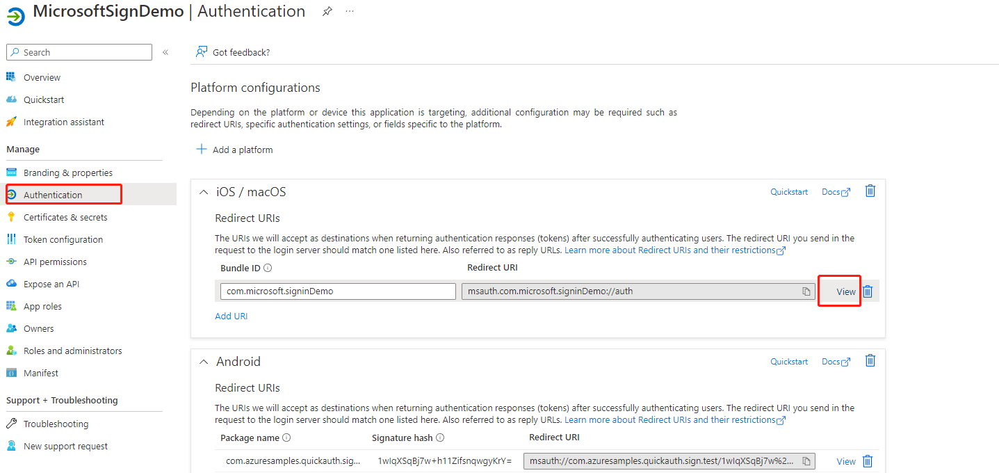
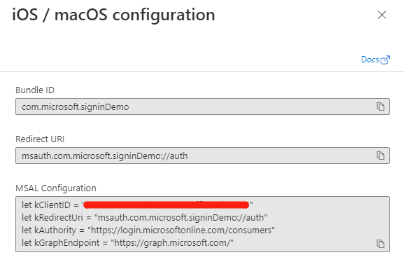
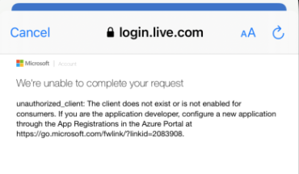
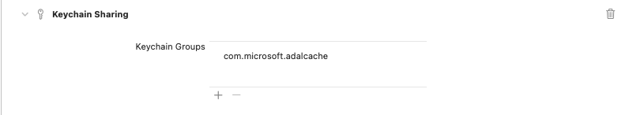
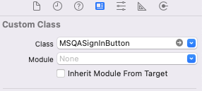

# Sign-in users with a Microsoft Account to iOS apps using Microsoft Quick Authentication


On iOS, Microsoft Quick Authentication offers a library that makes it easy to add **Sign in with Microsoft** support to your mobile native app. Quick Authentication uses the Microsoft Authentication Library (MSAL) for iOS to handle authentication and authorization for users with personal Microsoft accounts.

> Microsoft Quick Authentication is in public preview. This preview is provided without a service-level agreement and isn't recommended for production workloads. Some features might be unsupported or have constrained capabilities. For more information, see [Supplemental terms of use for Microsoft Azure previews](https://azure.microsoft.com/en-us/support/legal/preview-supplemental-terms/).

## How it works
Microsoft Quick Authentication allows you to easily add a fully functioning sign-in button to your iOS application that will take the user through the sign-in workflow with a personal Microsoft Account (MSA). Additionally, Quick Authentication allows you to sign-in your users silently whenever possible, to let them sign out of your application, and to perform more advanced tasks such as requesting an access token to retrieve additional account information.

To enable Quick Authentication in your application, you will need to follow these high level steps. Each step is further detailed in the rest of this document. 
1. First register your application for iOS on Azure (you can reuse the same Azure registration that you created for your web site). 
2. Install Microsoft Quick Authentication SDK and import the required header files in your application.
3. Create a Quick Authentication sign-in client object (`MSQASignIn`) with the proper configuration.
4. Add an Quick Authentication sign-in button somewhere in your application storyboard or XIB file.
5. Set a callback on the sign-in button to be notified when the user has completed the sign-in workflow.
6. Implement the callback to integrate the user account with your own identity system.

Quick Authentication will show a fully functioning sign-in button, looking as follows in its default form, and customizable with [Quick Authentication for the web](quick-authentication-how-to.md). In its default appearance, the button looks like this:

  

Note that at this time, the personalization of the user experience available with [Quick Authentication for the web](quick-authentication-how-to.md) is not available to iOS native apps. However, your users will still be able to sign-in using the button shown above, and benefit from SSO in some circumstances.

## Registering your application
If you have already registered a single-page web or an Android application, you can reuse the same application registration. To find that registration go to [Microsoft | App registrations](https://ms.portal.azure.com/#view/Microsoft_AAD_IAM/ActiveDirectoryMenuBlade/~/RegisteredApps) and select your existing application registration in the list. This will open a page describing your application registration.

 If you have not yet registered an application or wish to use a new registration, complete the steps in [Register an application with the Microsoft identity platform](https://docs.microsoft.com/en-us/azure/active-directory/develop/quickstart-register-app).

Now that you have created an application registration, you can extend it to iOS as follows. On the Azure page describing your app registration:

[**TODO** Minggang: please add one screenshot for each step, similar to what JingJing did in Android guide]
1. Open the *Authentication* tab on the left of that page
3. Click *Add Platform*
4. Select *iOS / MacOS*
5. Enter your app's Bundle ID, which can be found in XCode in the Info.plist or "Build Settings".
7. Click *Configure*

  
  

## Installing Microsoft Quick Authentication SDK
To install the Microsoft Quick Authentication SDK in your development environment, proceed as follows:
1. Install CocoaPods following the instructions in the [Getting Started guide](https://guides.cocoapods.org/using/getting-started.html)
2. Create a Podfile for your application and add the dependency on Microsoft Quick Authentication:
```bash
  $ pod init & pod 'MicrosoftQuickAuth'
```
3. Install the dependency:
```bash
  $ pod install
```
> **IMPORTANT**:
> the steps above are not yet operational. Currently, we only provide the Quick Authentication SDK for Android as a binary framework. The package is located at [MSQASignIn.framework](../demos/iOS/MSQASignIn.framework). Please proceed as follows:
> - Install [MSAL for Android](https://github.com/AzureAD/microsoft-authentication-library-for-objc) by running the following command: [**TODO**: Minggang, what else do developers have to do for the following command to instal MSAL?]:
>
>        $ pod install
> - Follow [these instructions](https://developer.apple.com/library/archive/technotes/tn2435/_index.html#//apple_ref/doc/uid/DTS40017543-CH1-EMBED_SECTION) to embed the Quick Authentication SDK into your application.


## Initializing your application
Create a `MSQAConfiguration` object to set the client ID for your application, which you will find in the Azure registration for your application. 

```objectivec
#import <MSQA/MSQASignIn.h>

MSQAConfiguration *config = [[MSQAConfiguration alloc]
      initWithClientID:@"YOUR_IOS_CLIENT_ID"];
```
and initialize a new instance of `MSQASignIn` as follows:
```objectivec
NSError *error = nil;
MSQASignIn *msSignIn = [[MSQASignIn alloc] initWithConfiguration:config
                                                           error:&error];
```                                                           
If an error accured, the `config` parameter will be nil and the `error` parameter will contain the error details.

If the client ID is invalid, a later attempt to sign-in or acquire an access token will fail. The error will be reported to the user as follows:

[**TODO**: Minggang, please provide non-blurry image]



## Configuring the application

Because Microsoft Quick Auth SDK builds on top of MSAL library, you will need to make the following MSAL configurations:
1.	Add a new keychain group, named com.microsoft.adalcache, to your project Capabilities:

[**TODO**: Minggang, please provide non-blurry image]
)
 
2.	Add your application’s redirect URL scheme to your Info.plist file:
```xml
<key>CFBundleURLTypes</key>
<array>
    <dict>
        <key>CFBundleURLSchemes</key>
        <array>
            <string>msauth.$(PRODUCT_BUNDLE_IDENTIFIER)</string>
        </array>
    </dict>
</array>
```

3.	Add LSApplicationQueriesSchemes to Info.plist. This will allow your application to open Microsoft Authenticator if installed. Note that scheme “msauthv3” is needed when compiling your app with Xcode 11 or later.
```xml
<key>LSApplicationQueriesSchemes</key> 
<array> 
  <string>msauthv2</string> 
  <string>msauthv3</string> 
</array>
```

4.	To handle the sign-in callback, implement the following AppDelegate method to call `MSQASignIn`’s `handleURL` to open a resource specified by the URL, and returns `YES` if the `MSQASignIn` successfully handled the request

```objectivec
- (BOOL)application:(UIApplication *)app
            openURL:(NSURL *)url
            options:(NSDictionary<UIApplicationOpenURLOptionsKey,id> *)options {
      return [_msSignIn
              handleURL:url
      sourceApplication:
          options[UIApplicationOpenURLOptionsSourceApplicationKey]];
}
```

## Adding a sign-in button to your application
Microsoft Quick Authentication allows you to add a fully functional sign-in button to your application. To do that, add a View to your storyboard or XIB file and set its custom class as `MSQASignInButton`.

[**TODO** Minggang: please provide non-blurry image]



This will generate a sign-in button in your application as follows:

[**TODO** Minggang: please provide non-blurry image]


Alternatively, you can also add the button programmatically at runtime with the following code:
```objectivec
- (void)viewDidLoad {
  [super viewDidLoad];

  CGRect buttonFrame = CGRectMake(10, 280, 100, 30);
  MSQASignInButton *button =
      [[MSQASignInButton alloc] initWithFrame:buttonFrame];
  [self.view addSubview:button];
}
```
It is possible to customize the appearance of the button. Refer to the [reference guide](quick-authentication-ios-reference.md#customizing-the-appearance-of-the-sign-in-button) for details.

## Getting a call back after the user has signed-in
To get a callback after the user has completed the sign-in flow - or an error has occurred -, set the completion block to be called using the `setSignInCompletionBlock` method of `MSQASignInButton`:

```objectivec
[msSignButton setSignInCompletionBlock:^(MSQAAccountData *_Nullable account,
                                         NSError *_Nullable error) {
  if (account) {
    // Use account
  }
  else if (error) {
    // Handle errors, e.g., not initialized.
    NSLog(@"%@", error.localizedDescription);
  }
}];
```
[**TODO** consistency: MSQAAccountData in iOS and MSQAAccountInfo in Android - Minggang: use MSQAAccountInfo everywhere once you have changed the code]

On success, the completion block will be invoked with the `MSQAAccountData` containing the following information:

```objectivec
@interface MSQAAccountData : NSObject <NSCopying> 

// MSA user's full name.
@property(nonatomic, readonly) NSString *fullName;

// MSA user's email address or phone.
@property(nonatomic, readonly) NSString *userName;

// CID for MSA account.
@property(nonatomic, readonly) NSString *userId;

// The user profile photo in Base64 encoded, will be nil if none.
@property(nonatomic, readonly, nullable) NSString *base64Photo;

// MSA account id token.
@property(nonatomic, readonly, nullable) NSString *idToken;

/// MSA user's surname.
@property(nonatomic, readonly, nullable) NSString *surname;

/// MSA user's given name.
@property(nonatomic, readonly, nullable) NSString *givenName;

/// MSA user's email.
@property(nonatomic, readonly, nullable) NSString *email;

@end
```
[**TODO** Add surname, given name, etc.]

## Handling sign out
To allow the user to sign out, in your application, connect a button to a method in the `ViewController` (called `signOut` in the example below) and call `MSQASignIn`'s method `signOutWithCompletionBlock`:
```objectivec
- (IBAction)signOut:(id)sender {
  [_msSignIn
      signOutWithCompletionBlock:^(NSError *_Nullable error) {
        if (error)
          NSLog(@"Error:%@", error.description);
      }];
}
```
