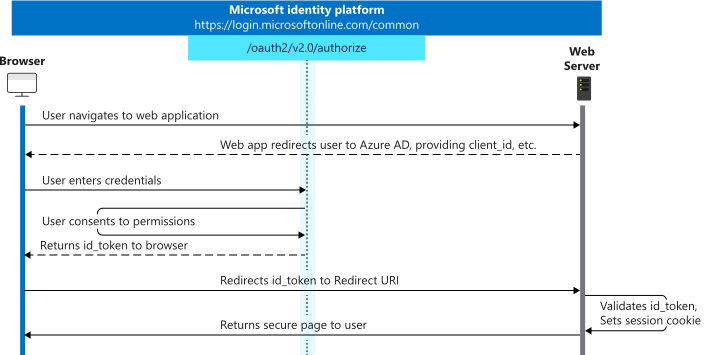

# Migration from OpenID Connect (OIDC) to Microsoft Quick Authentication

If you have engaged [OpenID Connect](https://learn.microsoft.com/en-us/azure/active-directory/develop/v2-protocols-oidc) on Microsoft identity platform, and want to migrate to Microsoft Quick Authentication, the easiest way is to leverage the [redirect mode](./quick-authentication-how-to.md#redirect-mode) provided by Microsoft Quick Authentication.

## What is redirection mode

In redirect mode, while signing in, the quick authentication does a full page redirection to MSA sign-in instead of a pop-up.

Compared with redirection mode, the basic OpenID Connect sign-in flow is below: <br/> 

In the first step, the user will be navigated to the the Microsoft identity platform's */authorize* endpoint by the web server, while in quick authentication redirection mode, this is done by the Quick Authentication library and the remaining steps are the same. So in redirection mode, the browser will be navigated to:

`https://login.microsoftonline.com/consumers/oauth2/v2.0/authorize` with the following parameters:

| Parameter    |Value                                                                  |
|----------------------------:|:-----------------------------------------------------------------------|
| `client_id`                    | the `client_id` passed when [initializing](./quick-authentication-reference.md#data-type-initconfiguration) Microsoft Quick library|
|`response_type` | `code` |
| `response_mode` | `form_post`                                   |
| `prompt`           | will be `select_account` if setting [`showAccountSelection`](./quick-authentication-reference.md#data-type-startsigninoptions) to `true`                                             |
| `redirect_uri`      | the `redirect_uri` passed when [initializing](./quick-authentication-reference.md#data-type-initconfiguration) Microsoft Quick library
| `state`      | the `redirect_state` passed when [initializing](./quick-authentication-reference.md#data-type-initconfiguration) Microsoft Quick library
| `scope`      | `['openid', 'profile', 'User.Read']` |

## How redirection mode works

To enable redirection, you can use any of the following approaches:

- Set `ux_mode` to "redirect" as property of [InitConfiguration](./quick-authentication-reference.md#data-type-initconfiguration)
- Set `data-ux_mode` to "redirect" as property in HTML id="ms-auth-initialize".

The redirection mode supports sign-in prompt, sign-in button and [`ms.auth.startSignIn`](./quick-authentication-reference.md#method-msauthstartsignin) method.

If user sign-in succeeds, then MSA server sends a `POST` request to the `redirect_uri` and the POST request contains following JSON:

  ```javascript
  {
    code: 'code-as-string-sent-by-msa-server'
    state: 'redirect_state-which-was-specified'
  }
  ```

For more details, please reference [**Redirect mode**](./quick-authentication-how-to.md#redirect-mode).
