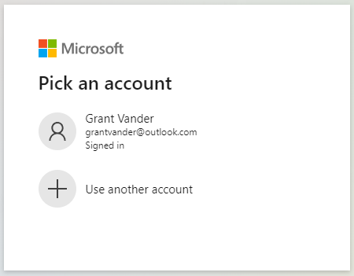

# Microsoft Quick Authentication configuration and JavaScript API reference

| [Getting Started](./quick-authentication-how-to.md)| [*Reference*](./quick-authentication-reference.md) |
|--|--|

These settings and APIs allow you to customize the appearance and behavior of the UI provided by Microsoft Quick Authentication.

For information about how to use Quick Authentication, see the [Getting Started guide](./quick-authentication-how-to.md).

> Microsoft Quick Authentication is in public preview. This preview is provided without a service-level agreement and isn't recommended for production workloads. Some features might be unsupported or have constrained capabilities. For more information, see [Supplemental terms of use for Microsoft Azure previews](https://azure.microsoft.com/en-us/support/legal/preview-supplemental-terms/).

## Logging with autoLogEvents

The `autoLogEvents` query parameter supports these log level values:

- `0`: Log only error events.
- `1`: Log only error and warning events.
- `2`: Log error, warning and information events.

## MSAL Logging with logMsalEvents

Quick Authentication is built on top of [MSAL.js](https://github.com/AzureAD/microsoft-authentication-library-for-js/tree/dev/lib/msal-browser). MSAL.js logging to console can also be enabled using `logMsalEvents` query parameter.

The `logMsalEvents` query parameter supports MSAL [log levels](https://azuread.github.io/microsoft-authentication-library-for-js/ref/enums/_azure_msal_common.loglevel.html):

- `0`: Error.
- `1`: Warning.
- `2`: Info
- `3`: Verbose.
- `4`: Trace.

`autoLogEvents` needs to be set (can be any value) for `logMsalEvents` take effect.

## Specifying the Quick Authentication initialization parameters
The following parameters can be used to initialize Quick Authentication. They are supplied as data attributes of the `ms-auth-initialize div` in your HTML. You can also choose to supply them programmatically in your Javascript (Refer to [Data Type: InitConfiguration](#data-type-initconfiguration)).

| Property                     | Value(s)                                                                      | Default value                 | Required | More info                                                                                                   |
|------------------------------|------------------------------------------------------------------------------|:-----------------------------:|----------|-------------------------------------------------------------------------------------------------------|
| `data-client_id`             | **Application (client) ID**                                                   | (no default value)            | Yes      | See [Register your application](quick-authentication-how-to.md#register-your-application).   |
| `data-login_uri`             | **Redirect URI for Single-page application**                                  | _https://&lt;domain&gt;/blank.html_ | Yes if `ux_mode == 'popup'`, else No | See [Register your application](quick-authentication-how-to.md#register-your-application). This URI is used when `ux_mode = 'popup'`. Check [this section](./quick-authentication-how-to.md#notes-on-redirect-uri-for-single-page-application-for-popup-mode) for some more details. |
| `data-callback`              | JavaScript function that receives account information once sign-in completes. | (no default value)            | Yes      | On successful sign-in, this function is called with the [SignInAccountInfo](#data-type-signinaccountinfo) object. <br/> On sign-in failure, it is called with second argument [SignInErrorInfo](#data-type-signinerrorinfo) containing the error. |
| `data-locale`                | `Language ID` strings in [table below](#supported-locales). e.g., `"en-US"`, `"fr-FR"`, etc. | `"en-US"`      | No       | Check `Language ID` column in [this table](#supported-locales) for possible values.                   |
| `data-ux_mode`               | "popup"<br/> "redirect"                                                       | "popup"                       | No       | If "redirect" is set then button sign-in and [ms.auth.startSignIn](#method-msauthstartsignin) calls will use redirect flow |
| `data-redirect_uri`          | **Redirect URI for Web**                                                      | (no default value)            | Yes if `ux_mode == 'redirect'`, else No |  Check [this section](./quick-authentication-how-to.md#1-add-redirect-uri-in-application-registration) for more info. |
| `data-redirect_state`        | A string which will be passed as `state` parameter for redirect flow.         | (no default value)            | No       | Only used if `ux_mode == 'redirect'`. Also check [ms.auth.setRedirectState](#method-msauthsetredirectstate) API and [redirect_state](#redirect_state). |

## Customizing the sign-in prompt

You can customize the setup of the Quick Authentication sign-in prompt using a handful of options. These values are supplied as data attributes of the `ms-auth-initialize div` in your HTML. You can also choose to supply them programmatically in your JavaScript. (Refer to [Data Type: InitConfiguration](#data-type-initconfiguration)).

| Property                     | Values                             | Default  | More Info |
|------------------------------|------------------------------------|----------|-----------|
| `data-auto_prompt`           | `true` or `false`                  | `true`   | Controls whether the one-tap prompt should show up. Only shows for MSA profiles in Microsoft Edge.|
| `data-auto_sign_in`          | `true` or `false`                  | `false`  | Only applicable when `auto_prompt` is `true`. If set to `true`, it will complete the sign-in automatically, without the user needing to do anything.|
| `data-context`               | "signin"<br/> "signup"<br/> "use"  | "signin" | Defines the text variant to be used in the prompt.<br> - "signin" = "Sign in with Microsoft" (default)<br> - "signup" = "Sign up with Microsoft" <br>- "use" = "Use Microsoft" |
| `data-cancel_on_tap_outside` | `true` or `false`                  | `true`   | Whether to close the prompt when a user moves focus out of the prompt. |
| `data-prompt_position`       | "left"<br/> "center"<br/> "right"  | "left"   | Prompt position with respect to the width of the web page |


## Customizing the sign-in button

You can customize the look and feel of the sign-in button using a handful of options. These values are supplied as part of the `renderSignInButton()` call in your JavaScript or as data attributes on the button container `div` in your HTML:

| Property              | Values                                                              | Default       |
|-----------------------|---------------------------------------------------------------------|---------------|
| `data-type`           | "standard"<br/> "icon"                                              | "standard"    |
| `data-theme`          | "dark"<br/> "light"                                                 | "dark"        |
| `data-size`           | "small"<br/> "medium"<br/> "large"                                  | "large"       |
| `data-text`           | "signin_with"<br/> "signup_with"<br/> "continue_with"<br/> "signin" | "signin_with" |
| `data-shape`          | "rectangular"<br/> "rounded"<br/> "pill"                            | "rectangular" |
| `data-width`          | number in CSS pixels<br/> 200–600                                   |               |
| `data-height`         | number in CSS pixels<br/> 24–100                                    |               |
| `data-logo_alignment` | "left"<br/> "center"                                                | "left"        |

### `type`

| standard (default)                                                                                                                                                                                                                                        | icon                                                                                         |
|-----------------------------------------------------------------------------------------------------------------------------------------------------------------------------------------------------------------------------------------------------------|----------------------------------------------------------------------------------------------|
| <br/>  |  |

### `theme`

| dark (default)                                                                                                                                                                                                                                | light                                                                                                                                                                                                                                     |
|-----------------------------------------------------------------------------------------------------------------------------------------------------------------------------------------------------------------------------------------------|-------------------------------------------------------------------------------------------------------------------------------------------------------------------------------------------------------------------------------------------|
| <br/>  | <br/>  |

### `size`

| small (28 px) | medium (36 px) | large (42 px - default) |
|---------|---------|---------|
| <br/>  | <br/>  | <br/>  |

### `text`

The `text` property governs the text shown in the sign-in button. Other properties affect what is finally shown as mentioned in table below.

| Text            | `standard` button         | `icon` button | `standard` button in Microsoft Edge MSA profile |
|-----------------|---------------------------|---------------|-------------------------------------------------|
| `signin_with`   | "Sign in with Microsoft"  | None          | "Sign in as Grant"                              |
| `signup_with`   | "Sign up with Microsoft"  | None          | "Sign up as Grant"                              |
| `continue_with` | "Continue with Microsoft" | None          | "Continue as Grant"                             |
| `signin`        | "Sign in"                 | None          | "Sign in as Grant"                              |

In above table, we assume "Grant Zander" is user signed into MSA profile in Microsoft Edge.

### `shape`

| rectangular (default) | rounded | pill |
|---------|---------|---------|
| <br/> |  | <br/>  |

### `logo_alignment`

| left | center (default) |
|---------|---------|
|  |  |

## JavaScript API reference - Microsoft Quick Authentication

## Data Type: InitConfiguration

`InitConfiguration` is the configuration object that needs to be passed as argument to [ms.auth.initialize](#method-msauthinitialize) method.

| Property                | Value(s)                                                                      | Default value                 | Required | More info                                                                                           |
|-------------------------|:------------------------------------------------------------------------------|:-----------------------------:|----------|-------------------------------------------------------------------------------------------------------|
| `client_id`             | **Application (client) ID**                                                   | (no default value)            | Yes      | See [Register your application](quick-authentication-how-to.md#register-your-application).   |
| `login_uri`             | **Redirect URI for Single-page application**                                  | _https://&lt;domain&gt;/blank.html_ | No       | See [Register your application](quick-authentication-how-to.md#register-your-application). This URI is used when `ux_mode = 'popup'`.|
| `callback`              | JavaScript function that receives account information once sign-in completes. | (no default value)            | Yes      | On successful sign-in, this function is called with the [SignInAccountInfo](#data-type-signinaccountinfo) object. <br/> On sign-in failure, it is called with second argument [SignInErrorInfo](#data-type-signinerrorinfo) containing the error. |
| `auto_prompt`           | `true` or `false`                                                             | `true`                        | No       |                                                                                                       |
| `auto_sign_in`          | `true` or `false`                                                             | `false`                       | No       |                                                                                                       |
| `context`               | "signin"<br/> "signup"<br/> "use"                                             | "signin"                      | No       |                                                                                                       |
| `cancel_on_tap_outside` | `true` or `false`                                                             | `true`                        | No       |                                                                                                       |
| `prompt_position`       | "left"<br/> "center"<br/> "right"                                             | "left"                        | No       |                                                                                                       |
| `locale`                | `Language ID` strings in [table below](#supported-locales). e.g., `"en-US"`, `"fr-FR"`, etc. | `"en-US"`      | No       | Check `Language ID` column in [this table](#supported-locales) for possible values.                   |
| `ux_mode`               | "popup"<br/> "redirect"                                                       | "popup"                       | No       | If "redirect" is set then button sign-in and [ms.auth.startSignIn](#method-msauthstartsignin) calls will use redirect flow |
| `redirect_uri`          | **Redirect URI for Web**                                                      | (no default value)            | Yes if `ux_mode == 'redirect'`, else No |  Check [this section](./quick-authentication-how-to.md#1-add-redirect-uri-in-application-registration) for more info. |
| `redirect_state`        | A string which will be passed as `state` parameter for redirect flow.         | (no default value)            | No       | Only used if `ux_mode == 'redirect'`. Also check [ms.auth.setRedirectState](#method-msauthsetredirectstate) API and [redirect_state](#redirect_state). |

### `redirect_state`

This is an optional string value which can be configured using any of the following approaches:
- `redirect_state` property of [InitConfiguration](./quick-authentication-reference.md#data-type-initconfiguration).
- `data-redirect_state` property in HTML `id="ms-auth-initialize"`.
- Using [ms.auth.setRedirectState](./quick-authentication-reference.md#method-msauthsetredirectstate) API.

## Data Type: AccountInfo

This data type contains following values.
| Property | Description | More info |
|----------|---------|---------------|
| `fullName` | User's full name | Can be empty |
| `surname` | User's surname | Can be empty |
| `givenName` | User's given name | Can be empty |
| `username` | User's email or phone number | Never empty |
| `email` | User's email address | Never empty |
| `photoUrl` | base64-encoded dataURI representing the user's avatar. If the user has set no avatar, its value will be `null`| Can be empty |
| `id` | an ID that is unique across all Microsoft accounts. This id can be used for some Microsoft Graph APIs (e.g., [User GET](https://learn.microsoft.com/en-us/graph/api/user-get?view=graph-rest-1.0&tabs=http)). | Never empty |
| `homeAccountId` | User's [home account identifier](https://azuread.github.io/microsoft-authentication-library-for-js/ref/modules/_azure_msal_common.html#accountinfo) which is used by MSAL | Never empty |

We recommend using either `id` or `homeAccountId` as a key, rather than the email address, because an email address isn't a unique account identifier. It's possible for a user to use a Gmail address for a Microsoft Account, and to potentially create two different accounts (a Microsoft account and a Google account) with that same email address. It's also possible for a Microsoft Account user to change the primary email address on their account.

## Data Type: SignInAccountInfo

This data type contains all the fields of [AccountInfo](#data-type-accountinfo) and a new field `idToken`.
| Property | Description | More info |
|----------|---------|---------------|
| `fullName` | User's full name | Can be empty |
| `surname` | the user's surname | Can be empty |
| `givenName` | the user's given name | Can be empty |
| `username` | User's email or phone number | Never empty |
| `email` | User's email address | Never empty |
| `photoUrl` | base64-encoded dataURI representing the user's avatar. If the user has set no avatar, its value will be `null`| Can be empty |
| `id` | an ID that is unique across all Microsoft accounts. This id can be used for some Microsoft Graph APIs (e.g., [User GET](https://learn.microsoft.com/en-us/graph/api/user-get?view=graph-rest-1.0&tabs=http)). | Never empty |
| `homeAccountId` | User's [home account identifier](https://azuread.github.io/microsoft-authentication-library-for-js/ref/modules/_azure_msal_common.html#accountinfo) which is used by MSAL | Never empty |
| `idToken` | [ID token](https://docs.microsoft.com/en-us/azure/active-directory/develop/id-tokens) received during sign-in process | Never empty |

We recommend using either `id` or `homeAccountId` as a key, rather than the email address, because an email address isn't a unique account identifier. It's possible for a user to use a Gmail address for a Microsoft Account, and to potentially create two different accounts (a Microsoft account and a Google account) with that same email address. It's also possible for a Microsoft Account user to change the primary email address on their account.

## Data Type: SignInErrorInfo

This data type contains the following:
| Property | Description |
|----------|---------|
| `errorCode` | A short string classifying the error |
| `errorMessage` | A longer string explaining more details about the error |

For example, if user cancels out of the sign-in flow, they will get the following error info object.

```javascript
{
 errorCode: 'user_cancelled',
 errorMessage: 'User cancelled the flow'
}
```

## Method: ms.auth.initialize

`ms.auth.initialize` is called to initialize Microsoft Quick Authentication library. It takes [InitConfiguration](#data-type-initconfiguration) object as argument. The following code example shows usage in `onload` function:

```javascript
window.onload = function () {
  const result = ms.auth.initialize({
    client_id: '<your application client ID>',
    callback: handleSignInResponse,
    login_uri: '<your application redirect URI>',
    cancel_on_tap_outside: false
  });
  if (result.result == 'success') {
    // Proceed.
  } else {
    // Initialization failed.
    console.error('ms.auth.initialize failed: ', result);
  }
};
```

1. Set `client_id` to the Application Client ID you received from Azure.
1. Set `callback` to the name of the JavaScript function you'd like called when a user is authenticated.
1. Set `login_uri` to the redirect URI specified in your application registration in Azure portal. If this property isn't set, then for website https://abc.com, Quick Authentication library will use https://abc.com/blank.html as the default.

If `ms.auth.initialize` succeeds, it will return `{result: 'success'}`. If it fails, it will return `{result: 'failure', reason: <string-explaining-why-it-failed>}`.

The following are some possible reasons for failure:

- Initialization was called more than once. Here API returns `{result: 'failure', reason: 'Library already initialized'}`.
- `callback` isn't a valid function or `client_id` isn't set. In these cases, API returns `{result: 'failure', reason: 'Invalid configuration'}`.
- If `ux_mode == 'redirect'` and `redirect_uri` is an `null`, `undefined` or empty string, API returns `{result: 'failure', reason: 'Invalid configuration'}`.

`ms.auth.initialize` or div ["ms-auth-initialize"](quick-authentication-how-to.md#option-1-add-sign-in-button-via-html) is needed to initialize Microsoft Quick Authentication library.

If initialization isn't done, all other API calls will fail.

## Data Type: ButtonConfiguration

This configuration object needs to be passed as argument to [ms.auth.renderSignInButton](#method-msauthrendersigninbutton) method.

| Property                          | Values                                                              | Default       | Required |
|-----------------------------------|---------------------------------------------------------------------|---------------|----------|
| [type](#type)                     | "standard"<br/> "icon"                                              | "standard"    | No       |
| [theme](#theme)                   | "dark"<br/> "light"                                                 | "dark"        | No       |
| [size](#size)                     | "small"<br/> "medium"<br/> "large"                                  | "large"       | No       |
| [text](#text)                     | "signin_with"<br/> "signup_with"<br/> "continue_with"<br/> "signin" | "signin_with" | No       |
| [shape](#shape)                   | "rectangular"<br/> "rounded"<br/> "pill"                            | "rectangular" | No       |
| `width`                           | number in CSS pixels<br/> 200–600                                   |               | No       |
| `height`                          | number in CSS pixels<br/> 24–100                                    |               | No       |
| [logo_alignment](#logo_alignment) | "left"<br/> "center"                                                | "left"        | No       |

## Method: ms.auth.renderSignInButton

`ms.auth.renderSignInButton` is called to render a sign-in button. See the following code example for understanding usage of this method:

```html
<div id="ms-button-holder"></div>
<script>
function addMicrosoftSignInButton() {
  const parent = document.getElementById('ms-button-holder');
  const options = {theme: 'light'}; // use light theme.
  ms.auth.renderSignInButton(parent, options);
};
</script>
```

It takes the following arguments:

1. `parent`: The HTMLElement under which this button will be rendered.
1. `options`: An object of type [ButtonConfiguration](#data-type-buttonconfiguration).

If `ms.auth.renderSignInButton` is called before initialization has been done or if parent (first argument) isn't set, then it will throw a string explaining the problem.

If the second argument (`options`) isn't set, then it uses default values mentioned in [button configuration table](#data-type-buttonconfiguration).

## Method: ms.auth.signOut

`ms.auth.signOut` is used to sign out a user. See the following code example for understanding usage of this method:

```javascript
ms.auth.signOut(homeAccountId, function (result) {
  if (result.result) {
    // Finish the logout process in your website.
  } else {
    console.log('Sign out failed, error: ', result.error);
  }
});
```

You'll need to pass in `homeAccountId` field of [AccountInfo](#data-type-accountinfo) object you received as part of the authentication event and a callback to receive the result of the `signOut()` call. The argument returned to the callback will be an object with the following structure:

- `result` - `true` if the user was signed out, `false` if not
- `error` - if `result==false`, will be an object with a `message` property explaining the error

If this method is called before initialization has been done using [ms.auth.initialize](#method-msauthinitialize) or using div ["ms-auth-initialize"](./quick-authentication-how-to.md#option-1-add-sign-in-button-via-html), then it will throw exception.

If the `callback` isn't a valid function, then also this API will throw exception.
If `homeAccountId` isn't found, the `callback` will be called with `{result: 'failure', error: 'account identifier not found'}`.

Note, for the moment there is a fallback. `username` can also be passed instead of `homeAccountId` to this API. But that will be removed in future revisions.

## Data Type: StartSignInOptions

`StartSignInOptions` is an object which can be optionally passed into [ms.auth.startSignIn](#method-msauthstartsignin) method.

| Property       | Value(s)                                                              | Default       | Required | More info |
|----------------|-----------------------------------------------------------------------|---------------|----------|-----------|
| `callback`       | JavaScript function that receives account information once sign-in completes with success or failure. | None  | No       | Behavior is same as `callback` member of [InitConfiguration](#data-type-initconfiguration). If this property is not specified, the `callback` member of [InitConfiguration](#data-type-initconfiguration) is called. |
| `showAccountSelection` | boolean                                                         | false         | No | If this is set to `true`, then MSA account picker is shown like below. <br/> <br/>Otherwise, for MSA profile in Edge, sign-in will complete without the user needing to enter credentials. And for other browsers, sign-in may or may not need credential input from user. |

## Method: ms.auth.startSignIn

`ms.auth.startSignIn` can be used to begin sign-in process programmatically. See the following code example for understanding usage of this method:

```javascript
button.addEventListener('click', function() {
  ms.auth.startSignIn();
});
```

In above usage, successful or failed authentications will be routed into the [callback](#callback) defined when initializing the library.

If this method is called before initialization has been done using [ms.auth.initialize](#method-msauthinitialize) or using div ["ms-auth-initialize"](./quick-authentication-how-to.md#option-1-add-sign-in-button-via-html), then it will throw an exception.

In [redirect flow](./quick-authentication-how-to.md#msauthstartsignin-in-redirect-mode), the callback will not be called. Instead a full page redirection flow to MSA server will start.

`ms.auth.startSignIn` also accepts an optional [StartSignInOptions](#data-type-startsigninoptions) argument.

`showAccountSelection` member of [StartSignInOptions](#data-type-startsigninoptions) can be set to true to show MSA account picker prompt.
<br/>

Here is some sample code showing that behavior:
```javascript
button.addEventListener('click', function() {
  // To show account picker.
  const startSignInOptions = {showAccountSelection: true};
  ms.auth.startSignIn(startSignInOptions);
});
```

`callback` member of [StartSignInOptions](#data-type-startsigninoptions) can be set to a JavaScript function to ensure that it gets called on sign-in success or failure. Here is some sample code showing that behavior:

```javascript
function startSignInCallback(signInAccountInfo, signInErrorInfo) {
  console.log(signInAccountInfo);
  if (!signInAccountInfo) {
    // Sign in failed. signInErrorInfo will be non-null.
    const errorCode = signInErrorInfo.errorCode; // Short string.
    const errorMessage = signInErrorInfo.errorMessage; // Longer string.
    console.log(`sign in failed: errorCode: ${errorCode}, errorMessage: ${errorMessage}`);
    return;
  }
  // Sign-in succeeded. Use signInAccountInfo in sign in/up logic.
}

button.addEventListener('click', function() {
  // To show account picker.
  const startSignInOptions = {callback: startSignInCallback};
  ms.auth.startSignIn(startSignInOptions);
});
```

If `callback` is not `undefined` or `null` and is not a function, then this function will throw an exception.

As mentioned above, in [redirect flow](./quick-authentication-how-to.md#msauthstartsignin-in-redirect-mode), the callback will not be called.

## Method: ms.auth.startGetCurrentAccount

`ms.auth.startGetCurrentAccount` can be used to determine if the current user signed-in. See the following code example for understanding usage of this method:

```javascript
function accountCallback(account_info) {
  if (account_info) {
    // Use account.
  }
}

ms.auth.startGetCurrentAccount(accountCallback);
```

It takes as argument a function. On completion, this function will be called with [AccountInfo](#data-type-accountinfo) representing the signed-in user.

If the user is signed-in, [AccountInfo](#data-type-accountinfo) will be a valid object. If the user isn't signed-in, the argument will be `null`.

If this method is called before initialization has been done using [ms.auth.initialize](#method-msauthinitialize) or using div ["ms-auth-initialize"](./quick-authentication-how-to.md#option-1-add-sign-in-button-via-html), then it will throw exception.

## Data Type: PromptMomentNotification

`PromptMomentNotification` has the following structure:

- `type` - the moment type as a `String`; will be one of
  - "display" - Occurs after `prompt()` method is called. If prompt shows, `displayed` property will be true, else `displayed` will be false.
  - "skipped" - Occurs when the prompt is closed by user manually canceling the prompt or closing prompt by tapping outside, etc.
  - "dismissed" - Occurs when a) credentials were successfully retrieved b) `ms.auth.cancel` was called to close the prompt.
- `displayed`    - A boolean based on whether the UI is displayed; will be `undefined` if `type` isn't "display"
- `reason` - the reason the notification callback was called as a `String`; will be `undefined` if `type` is "display" and `displayed` is `true`.

 The value of `reason` will vary based on the `type` value:

- `type == "display"`
  - "another_prompt_running"
  - "browser_not_supported"
  - "in_cooldown_period"
  - "non_msa_profile"
  - "unknown"
- `type == "skipped"`
  - "tap_outside"
  - "user_cancelled"
  - "unknown"
- `type == "dismissed"`
  - "cancel_called"
  - "credential_returned"

## Method: ms.auth.prompt

`ms.auth.prompt()` method can be used to control the display of enhanced sign-in prompt in MSA profile in Microsoft Edge. See the following code example for understanding usage of this method:

```javascript
ms.auth.prompt('right', function(notification) {
  const reason = notification.reason;
  if (notification.type === 'display' && !notification.displayed) {
    if ( reason === 'browser_not_supported' ) {
      console.log('prompt not supported in browser');
    }
  } else if (notification.type === 'skipped') {
    if (reason === 'user_cancel') {
      console.log('user cancelled');
    }
  } else if (notification.type === 'dismissed') {
    if (reason === 'credential_returned') {
      console.log('Got sign-in credentials');
    }
  }
});
```

This method may be called with no arguments to use the default configuration. You may also supply the following arguments to customize its appearance and/or respond to specific user interactions with the prompt.

The first argument is the position. By default, the prompt is rendered on the left. You can position it "center" or "right" as well.

The second argument is a callback function that receives notifications from the prompt, based on user interactions. The callback receives a [PromptMomentNotification](#data-type-promptmomentnotification) object when the user interacts with it.

If this method is called before initialization has been done using [ms.auth.initialize](#method-msauthinitialize) or using div ["ms-auth-initialize"](./quick-authentication-how-to.md#option-1-add-sign-in-button-via-html), then it will throw exception.

If the `callback` is specified in second argument isn't `null` or `undefined`, it has to be a valid function, otherwise this API will throw exception.

The sign-in prompt will only show in a profile signed in with MSA account in Microsoft Edge. For non-MSA profile in Microsoft Edge, it will not be displayed and [PromptMomentNotification](#data-type-promptmomentnotification) will have `reason === 'non_msa_profile'`. For other browsers, [PromptMomentNotification](#data-type-promptmomentnotification) will have `reason === 'browser_not_supported'`.

## Method: ms.auth.cancel

`ms.auth.cancel` can be used to close the enhanced sign-in prompt in MSA profile in Microsoft Edge. See the following code example for understanding usage of this method:

```javascript
ms.auth.cancel();
```

This method will be a no-op if there's no prompt showing.

If a prompt was showing and it was dismissed using this method, then the callback registered with [ms.auth.prompt](#method-msauthprompt) will receive [PromptMomentNotification](#data-type-promptmomentnotification) object `{ type: "dismissed", reason: "cancel_called" }`.

If this method is called before initialization has been done using [ms.auth.initialize](#method-msauthinitialize) or using div ["ms-auth-initialize"](./quick-authentication-how-to.md#option-1-add-sign-in-button-via-html), then it will throw exception.

## Method: ms.auth.getMSALAccount

Quick Authentication uses [MSAL.js](https://github.com/AzureAD/microsoft-authentication-library-for-js/tree/dev/lib/msal-browser) internally.
MSAL.js provides functionality for fetching tokens. Quick Authentication exposes APIs to use MSAL.js functionality for fetching token.

`ms.auth.getMSALAccount` method can be used to get MSAL account info, which is needed to fetch MSAL token. See the following code example for understanding usage of this method:

```javascript
const msalAccount = ms.auth.getMSALAccount(accountInfo.homeAccountId);
if (msalAccount) {
  // Use the MSAL account.
} else {
  console.log(`No MSAL account exists for ${accountInfo.homeAccountId}`);
}
```

`homeAccountId` is the homeAccountId field in [AccountInfo](#data-type-accountinfo), which was returned to the callback after a successful sign-in.

If it succeeds, the API will return the [MSAL account information](https://azuread.github.io/microsoft-authentication-library-for-js/ref/modules/_azure_msal_common.html#accountinfo) corresponding to the `homeAccountId`.

If the account can't be found, `null` will be returned.

If this method is called before initialization has been done using [ms.auth.initialize](#method-msauthinitialize) or using div ["ms-auth-initialize"](./quick-authentication-how-to.md#option-1-add-sign-in-button-via-html), then it will throw exception.

Note, for the moment there is a fallback. `username` can also be passed instead of `homeAccountId` to this API. But that will be removed in future revisions.

## Method: ms.auth.acquireTokenSilent

`ms.auth.acquireTokenSilent` can be used to fetch tokens silently. See the following code example for understanding usage of this method:

```javascript
function tokenFetchResponse(response) {
  if (response && response.accessToken) {
    // Use accessToken.
  }
}

const request = {
  scopes: ["User.Read"],
  account: ms.auth.getMSALAccount(accountInfo.homeAccountId),
}
if (!request.account) {
  console.log('Silent token fetch failed: Account not found');
} else {
  ms.auth.acquireTokenSilent(request).then(tokenFetchResponse).catch(err => {
    console.log("Token fetch failed with error: " , err);
  });
}
```

If this method is called before initialization has been done using [ms.auth.initialize](#method-msauthinitialize) or using div ["ms-auth-initialize"](./quick-authentication-how-to.md#option-1-add-sign-in-button-via-html), then it will throw an exception.

Check [MSAL.js access token fetch documentation](https://github.com/AzureAD/microsoft-authentication-library-for-js/blob/dev/lib/msal-browser/docs/acquire-token.md) for more information. Also check [MSAL.js acquireTokenSilent](https://azuread.github.io/microsoft-authentication-library-for-js/ref/classes/_azure_msal_browser.publicclientapplication.html#acquiretokensilent) API documentation.

## Data Type: ms.auth.InteractionRequiredAuthError

`ms.auth.InteractionRequiredAuthError` is error type thrown in case [ms.auth.acquireTokenSilent](#method-msauthacquiretokensilent) fails with user interaction. In such a case, [ms.auth.acquireTokenPopup](#method-msauthacquiretokenpopup) can be used to fetch the token.

## Method: ms.auth.acquireTokenPopup

`ms.auth.acquireTokenPopup` can be called to fetch tokens in case fetching tokens silently fail. See the following code example for understanding usage of this method:

```javascript
function tokenFetchResponse(response) {
  if (response && response.accessToken) {
    // Use accessToken.
  }
}

const request = {
  scopes: ["Mail.Read"],
  account: ms.auth.getMSALAccount(accountInfo.homeAccountId),
}
if (request.account) {
  ms.auth.acquireTokenSilent(request).then(tokenFetchResponse).catch(err => {
    if (err instanceof ms.auth.InteractionRequiredAuthError) {
      ms.auth.acquireTokenPopup(request);
    }
  });
}
```

If this method is called before initialization has been done using [ms.auth.initialize](#method-msauthinitialize) or using div ["ms-auth-initialize"](./quick-authentication-how-to.md#option-1-add-sign-in-button-via-html), then it will throw an exception.

Check [MSAL.js access token fetch documentation](https://github.com/AzureAD/microsoft-authentication-library-for-js/blob/dev/lib/msal-browser/docs/acquire-token.md) for more information. Also check [MSAL.js acquireTokenPopup](https://azuread.github.io/microsoft-authentication-library-for-js/ref/classes/_azure_msal_browser.publicclientapplication.html#acquiretokenpopup) API documentation.

## Method: ms.auth.setRedirectState

If `ux_mode == 'redirect'` then `ms.auth.setRedirectState` can be called to set a string which will be used as `state` parameter during redirection.

```javascript
ms.auth.setRedirectState('some-unique-string-that-is-known-by-your-server');
```

Check [this section](#redirect_state) for more info on redirect state.

If this method is called before initialization has been done using [ms.auth.initialize](#method-msauthinitialize) or using div ["ms-auth-initialize"](./quick-authentication-how-to.md#option-1-add-sign-in-button-via-html), then it will throw exception.

## Supported locales

| Language ID      |  Language name                             |
|------------------|:-------------------------------------------|
| `af-ZA`          | Afrikaans (South Africa)                   |
| `am-ET`          | Amharic (Ethiopia)                         |
| `ar-SA`          | Arabic (Saudi Arabia)                      |
| `as-IN`          | Assamese (India)                           |
| `az-Latn-AZ`     | Azerbaijani (Latin, Azerbaijan)            |
| `bg-BG`          | Bulgarian (Bulgaria)                       |
| `bn-IN`          | Bangla (India)                             |
| `bs-Latn-BA`     | Bosnian (Latin, Bosnia and Herzegovina)    |
| `ca-ES`          | Catalan (Catalan)                          |
| `ca-ES-valencia` | Valencian (Spain)                          |
| `cs-CZ`          | Czech (Czech Republic)                     |
| `cy-GB`          | Welsh (United Kingdom)                     |
| `da-DK`          | Danish (Denmark)                           |
| `de-DE`          | German (Germany)                           |
| `el-GR`          | Greek (Greece)                             |
| `en-GB`          | English (United Kingdom)                   |
| `en-US`          | English (United States)                    |
| `es-ES`          | Spanish (Spain, International Sort)        |
| `es-MX`          | Spanish (Mexico)                           |
| `et-EE`          | Estonian (Estonia)                         |
| `eu-ES`          | Basque (Basque)                            |
| `fa-IR`          | Persian                                    |
| `fi-FI`          | Finnish (Finland)                          |
| `fil-PH`         | Filipino (Philippines)                     |
| `fr-CA`          | French (Canada)                            |
| `fr-FR`          | French (France)                            |
| `ga-IE`          | Irish (Ireland)                            |
| `gd-GB`          | Scottish Gaelic (United Kingdom)           |
| `gl-ES`          | Galician (Galician)                        |
| `gu-IN`          | Gujarati (India)                           |
| `he-IL`          | Hebrew (Israel)                            |
| `hi-IN`          | Hindi (India)                              |
| `hr-HR`          | Croatian (Croatia)                         |
| `hu-HU`          | Hungarian (Hungary)                        |
| `hy-AM`          | Armenian (Armenia)                         |
| `id-ID`          | Indonesian (Indonesia)                     |
| `is-IS`          | Icelandic (Iceland)                        |
| `it-IT`          | Italian (Italy)                            |
| `ja-JP`          | Japanese (Japan)                           |
| `ka-GE`          | Georgian (Georgia)                         |
| `kk-KZ`          | Kazakh (Kazakhstan)                        |
| `km-KH`          | Khmer (Cambodia)                           |
| `kn-IN`          | Kannada (India)                            |
| `kok-IN`         | Konkani (India)                            |
| `ko-KR`          | Korean (Korea)                             |
| `lb-LU`          | Luxembourgish (Luxembourg)                 |
| `lo-LA`          | Lao (Laos P.D.R.)                          |
| `lt-LT`          | Lithuanian (Lithuania)                     |
| `lv-LV`          | Latvian (Latvia)                           |
| `mi-NZ`          | Maori (New Zealand)                        |
| `mk-MK`          | Macedonian (North Macedonia)               |
| `ml-IN`          | Malayalam (India)                          |
| `mr-IN`          | Marathi (India)                            |
| `ms-MY`          | Malay (Malaysia)                           |
| `mt-MT`          | Maltese (Malta)                            |
| `nb-NO`          | Norwegian, Bokmål (Norway)                 |
| `ne-NP`          | Nepali (Nepal)                             |
| `nl-NL`          | Dutch (Netherlands)                        |
| `nn-NO`          | Norwegian, Nynorsk (Norway)                |
| `or-IN`          | Odia                                       |
| `pa-IN`          | Punjabi (India)                            |
| `pl-PL`          | Polish (Poland)                            |
| `pt-BR`          | Portuguese (Brazil)                        |
| `pt-PT`          | Portuguese (Portugal)                      |
| `quz-PE`         | Quechua (Peru)                             |
| `ro-RO`          | Romanian (Romania)                         |
| `ru-RU`          | Russian (Russia)                           |
| `sk-SK`          | Slovak (Slovakia)                          |
| `sl-SI`          | Slovenian (Slovenia)                       |
| `sq-AL`          | Albanian (Albania)                         |
| `sr-Cyrl-BA`     | Serbian (Cyrillic, Bosnia and Herzegovina) |
| `sr-Cyrl-RS`     | Serbian (Cyrillic, Serbia)                 |
| `sr-Latn-RS`     | Serbian (Latin, Serbia)                    |
| `sv-SE`          | Swedish (Sweden)                           |
| `ta-IN`          | Tamil (India)                              |
| `te-IN`          | Telugu (India)                             |
| `th-TH`          | Thai (Thailand)                            |
| `tr-TR`          | Turkish (Turkey)                           |
| `tt-RU`          | Tatar (Russia)                             |
| `ug-CN`          | Uyghur (PRC)                               |
| `uk-UA`          | Ukrainian (Ukraine)                        |
| `ur-PK`          | Urdu (Islamic Republic of Pakistan)        |
| `uz-Latn-UZ`     | Uzbek (Latin, Uzbekistan)                  |
| `vi-VN`          | Vietnamese (Vietnam)                       |
| `zh-CN`          | Chinese (Simplified, PRC)                  |
| `zh-TW`          | Chinese (Traditional, Taiwan)              |
